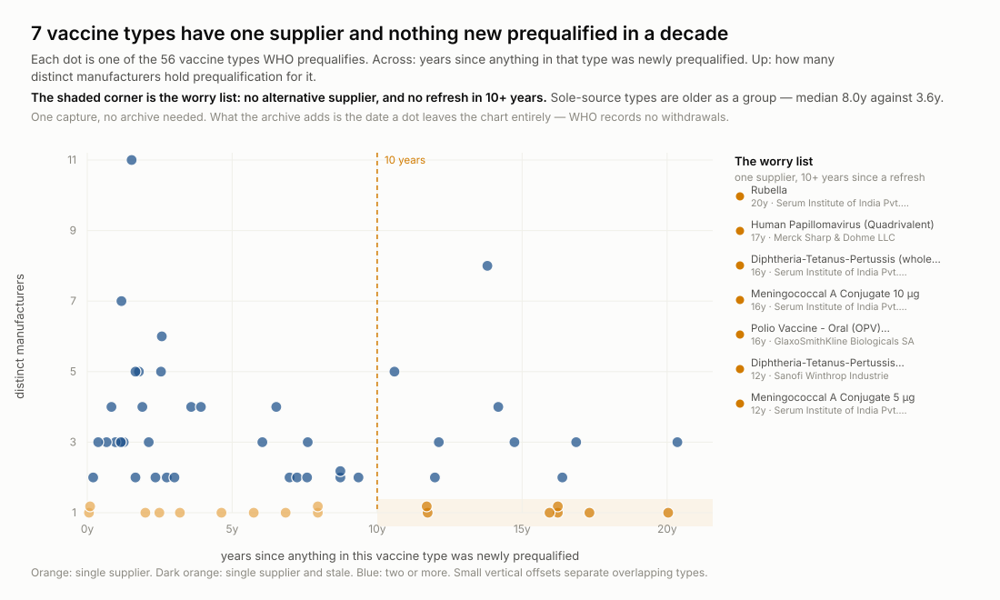
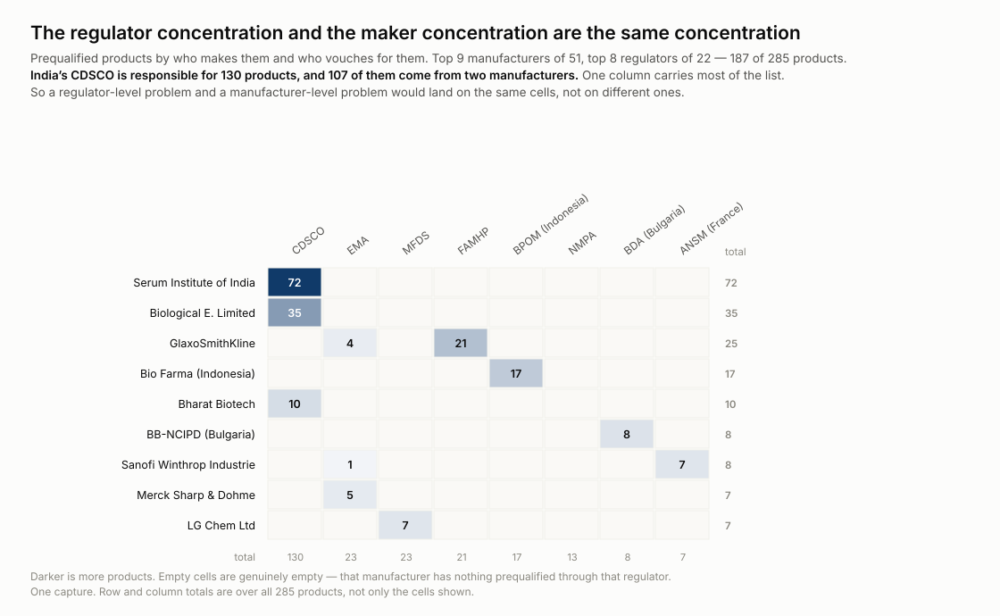
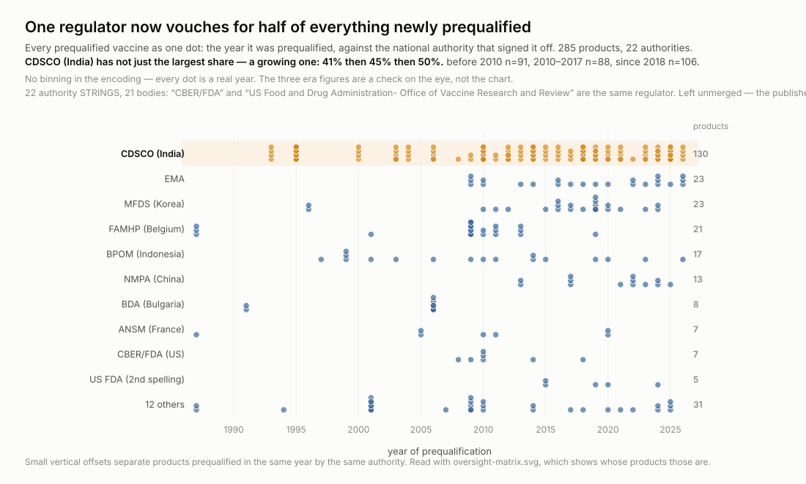
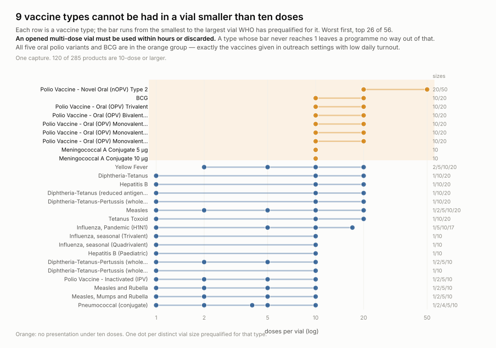

# wss-who-prequal — what WHO has prequalified, and what it quietly stopped listing

**WHO prequalification is a procurement gate.** UNICEF Supply Division and Gavi
may only buy prequalified product, so this list decides what reaches most of the
world's routine immunisation programmes. **285 vaccines** are on it today.

**It publishes seven columns and not one of them is a status.** There is no
delisted, withdrawn or suspended page, no dated file series, no export and no
archive. A product that leaves simply stops appearing — and WHO's own procedures
have a section headed *"Withdrawal from the list of WHO-prequalified vaccines"*
saying it happens routinely when a manufacturer discontinues production.

This repository captures the list **monthly**. Each capture is a dated statement
that these products held prequalification on that day. **The first one that
shrinks is what it exists for.**

<p align="center">
  
</p>

**17 of 56 vaccine types have exactly one prequalified manufacturer, and 7 of
those have had nothing new in over a decade** — Rubella's newest is 20 years
old. Each is one withdrawal away from no WHO-prequalified supply at all.

<p align="center">
  
</p>

**And they are not 17 independent risks.** Serum Institute of India is sole
maker for six of them, Merck for three.

<p align="center">
  
</p>

<p align="center">
  
</p>

**Nor does oversight diversify them.** India's CDSCO is the responsible
authority for 130 of the 285, and 107 of those come from two manufacturers — and
its share is growing: **41%** before 2010, **45%** in 2010–2017, **50%** since
2018.

<p align="center">
  
</p>

**Nine types cannot be had in a vial under ten doses** — all five oral polio
variants, BCG, both Meningococcal A conjugates. An opened multi-dose vial must
be used within hours, and these are the vaccines given in low-turnout outreach.

The five charts are a chain: the exposure, whether it is concentrated, whether
oversight offsets it, where it is heading, and what it costs operationally.

## The data

`derived/observations/<YYYY-MM>.csv.gz` — one row per entity, per metric, per
capture:

```
series_id, entity_id, observed_at, captured_at, metric, value, unit, source_id, raw_ref, parser_version
```

`entity_id` is WHO's own product slug. `raw_ref` points at the archived response
the row was parsed from, so every number is checkable back to bytes.

**[`SCHEMA.md`](SCHEMA.md) describes the shape without downloading anything** —
every metric with its type, cardinality and range, per series. Generated at
derive time, never hand-written.

```bash
duckdb -c "SELECT * FROM read_csv_auto('derived/observations/*.csv.gz') LIMIT 5"
python examples/load_observations.py    # sqlite + example queries
```

| series | what it lists | covered since | status |
| --- | --- | --- | --- |
| `who.pq.vaccines` | prequalified vaccines, one row per product | 2026-09 | ongoing |
| `who.pq.vaccines.pages` | fetch shape: rows per page, truncation alarm | 2026-09 | ongoing |

A discontinued series keeps its row with a *covered until* date. Nothing already
published is removed.

## The one number to watch

`next_page_present` on the last configured page. The list is paginated and the
registry names pages 0–5; page 5 held 35 rows and dropped its `rel="next"` link
on 2026-09-15. **If it ever reports 1, the list has outgrown the endpoints and a
product is being missed silently.**

## How it runs

Three scheduled workflows a month — capture on the 7th, derive an hour later,
health on the 8th — on the [wss](https://github.com/q3dresearch/wss-engine)
engine, pinned to one version. No workflow names a source: capture shards
whatever `registry/` marks active. The bot commits data only.

Questions, open and closed, with the precision ceiling this cohort can reach:
**[`docs/research-questions.md`](docs/research-questions.md)**.

## Licence

Code MIT (see `LICENSE`). **The captured data is WHO's and is CC BY-NC-SA 3.0
IGO — non-commercial, attribution, share-alike.** That is more restrictive than
most open-government sources; commercial permission can only come from WHO. See
[`LICENSE-DATA`](LICENSE-DATA) before reusing anything.
