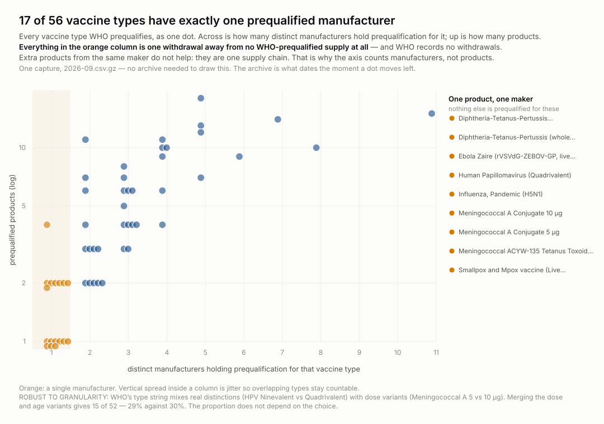
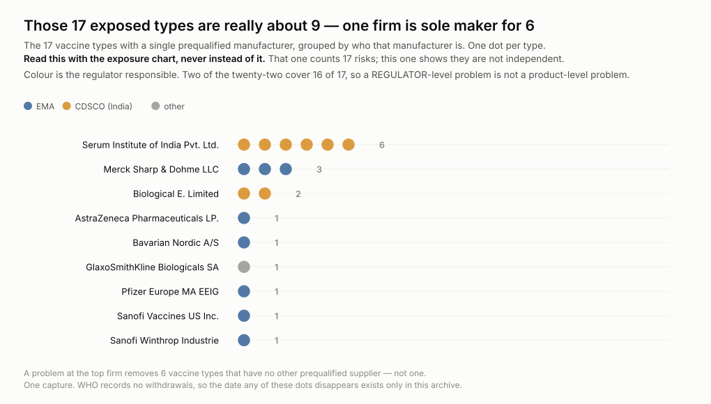

# wss-who-prequal — what WHO has prequalified, and what it quietly stopped listing

**WHO prequalification is a procurement gate.** UNICEF Supply Division and Gavi
may only buy prequalified product, so presence on WHO's list decides what
reaches most of the world's routine immunisation programmes. There are **285
prequalified vaccines** today, across six pages of fifty.

**The list says who holds it now, and nothing else.** Its seven columns are
Date of Prequalification, Vaccine Type, Commercial Name, Presentation, No. of
doses, Manufacturer and Responsible NRA — not one of them is a status. The
Drupal view behind it exposes thirteen filters and every one is a product
attribute. There is no delisted, withdrawn or suspended page (all three 404),
no dated file series, no CSV export and no archive path.

**And WHO says plainly that it removes products.** The list page states *"WHO
may suspend or remove a vaccine from the list"*, and WHO's post-prequalification
procedures carry a section headed *"Withdrawal from the list of WHO-prequalified
vaccines"*, noting that in most cases status is withdrawn voluntarily by a
manufacturer when production is discontinued. So departure is routine — and it
is exactly what is never written down.

<p align="center">
  
</p>

**17 of 56 vaccine types have exactly one prequalified manufacturer** — Ebola
Zaire, both HPV valencies, Pandemic Influenza H5N1 among them. Each is one
withdrawal away from having no WHO-prequalified supply at all, and WHO records
no withdrawals. (29% with dose variants merged, so the proportion does not
depend on how the types are cut.)

<p align="center">
  
</p>

**But those 17 are not 17 independent risks.** Serum Institute of India is the
sole maker for **six** of them and Merck for **three**, and two regulators of
the twenty-two — EMA and India's CDSCO — are responsible for **sixteen of the
seventeen**. A problem at one firm removes six vaccine types that have no other
prequalified supplier.

**These two charts must be read together.** The first counts the exposure; the
second says it is concentrated. Taken alone the first overstates how
diversified the failure modes are.

A GitHub Actions pipeline captures the list **monthly** and publishes it here as
clean, append-only CSVs. Each capture is a dated statement that these 285
products held prequalification on that day. The first one that shrinks is the
thing this archive exists for.

**What this can and cannot become.** 285 products is the ceiling: a departure
rate takes years to pin down, and any ranking of manufacturers by risk would be
overselling it. What it answers well is evidentiary — *which product held
prequalification on which date* — and that is a lookup no other source offers.
The arithmetic is in [`docs/research-questions.md`](docs/research-questions.md).

## The data you get

The files to query are `derived/observations/<YYYY-MM>.csv` — one row per
entity, per metric, per day:

```
series_id, entity_id, observed_at, captured_at, metric, value, unit, source_id, raw_ref, parser_version
```

- `entity_id` — the thing being measured
- `observed_at` / `captured_at` — when the fact was true / when we saw it
- `raw_ref` — the archived response the row was parsed from, so every number
  is checkable back to bytes

```bash
head derived/observations/*.csv            # no tooling required
python examples/load_observations.py       # sqlite + example queries
duckdb -c "SELECT * FROM read_csv_auto('derived/observations/*.csv') LIMIT 5"
```

## Coverage

Date ranges are machine-readable in [health/health.csv](health/health.csv)
(`first_success_at` → `last_success_at`, updated each run).

| series | what it lists | covered since | status |
| --- | --- | --- | --- |
| _add a row per source_ | | | ongoing |

Rules for this table: a **new series** gets a row with the date coverage
starts; a **discontinued series** keeps its row with a *covered until* date
and status *discontinued* — its data stays in the repo forever. Nothing
already published is removed.

## What you can build from it

<!-- TODO: the end products. Trend curves, leaderboards, survival analysis,
     divergence between attention and usage — whatever this domain supports. -->

## How it runs

Three scheduled workflows a day — capture (22:10 UTC), health (23:40),
derive (00:20) — powered by the
[wss](https://github.com/q3dresearch/wss) engine, pinned to one
version. No workflow ever names a source: capture shards whatever
`registry/` marks active, so infrastructure never changes when sources do.
The bot commits **data only** — it never changes code; the one config it may
touch is flipping a repeatedly-failing source to `auto_disabled`, with an
issue explaining why.

## Adding a source

1. Add `registry/<source_id>.yml` (copy the example entry), `status: paused`.
2. Add a parser in `parsers/` if the payload shape is new.
3. `wss doctor <source_id>` — **read the raw response**.
4. Flip to `status: active`, add a Coverage row, commit.

Nothing else. No workflow edits, ever.

## Run it locally

```bash
python -m venv .venv && . .venv/bin/activate
pip install -r requirements.txt
export WSS_CONTACT="you@example.com"   # identifies you to publishers

wss validate
wss doctor <source_id>
wss capture --cadence monthly
wss derive --parsers parsers.<module>
wss health --dry-run
```

## Going live

1. Push this repo **and the engine repo** under the same GitHub owner
   (`q3dresearch`) — the workflows install the engine from
   `github.com/q3dresearch/wss` at the pinned tag.
2. Set the repo secret **`WSS_CONTACT`** — capture refuses to run
   without it.
3. Run `capture-weekly` once by hand (Actions → capture-weekly → Run
   workflow), confirm the bot's data commit lands, then let the cron take
   over.

## Licences

Two separate files, on purpose: code is MIT ([LICENSE](LICENSE)); data
(`raw/`, `manifest/`, `derived/`) is CC-BY-4.0
([LICENSE-DATA](LICENSE-DATA)), citation in [CITATION.cff](CITATION.cff).
Captured content remains subject to the publisher's own terms.

Topics: `git-scraping` · `open-data` · `point-in-time-data` · `dataset`

## The one number to watch

`next_page_present` on the last configured page. The list is paginated and the
registry names pages 0–5 explicitly; page 5 held 35 rows and dropped its
`rel="next"` link on 2026-09-15. **If page 5 ever reports `next_page_present=1`
the list has grown past the endpoints and a product is being missed silently.**
That is a data value rather than a hope that somebody notices.

## Traps, recorded so the next person does not pay for them

**Do not grep these pages for status words.** `withdraw` appears twelve times in
the HTML of the vaccines list and **all twelve are the EU cookie banner's
"Withdraw consent"**. The same is true of WHO's antivenom list. Read the table.

**The key is the product slug, not the name.** Each row links to
`/prequal/vaccines/p/<slug>` — `abrysvo`, `pneubevax-14r`, and `bevacr-0` /
`bevacr-1` for two presentations of one brand. Hashing commercial name and
manufacturer was the alternative; it turns a rename into a departure plus an
arrival, which is the one event this archive exists to catch.

**`<time datetime>` carries a spurious time-of-day.** The attribute reads
`2025-01-16T17:37:05+01:00` while the cell shows `16/01/2025`. The time is a
record-editing timestamp. Only the date is emitted.

**The HTML ships Drupal THEME DEBUG comments inside every cell.** Strip comments
before tags or cell text comes out as a paragraph of template paths.

## Licence

The captured data is WHO's and is **CC BY-NC-SA 3.0 IGO — non-commercial, with
attribution and share-alike**. This is more restrictive than most sources in
this fleet. Read [`LICENSE-DATA`](LICENSE-DATA) before reusing anything;
commercial permission can only come from WHO.
